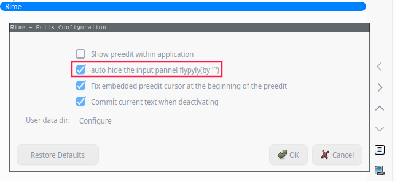

# fcitx5-rime自动隐藏候选框
## 介绍

用fcitx5-rime去挂接小鹤音形后，确实满足linux日常下基本输入。习惯了windows下隐藏候选框(如果有`时则自动显示)，但fcitx5并没有提供类似的功能。

所以，考虑在源码的基础上做一些小改动来实现这个功能，配合小鹤音形一起使用，输入会更加的流畅。

## 效果




## 快速开始
> 要求对应的fcitx5-rime版本为5.1.6-1,更新的版本也可以尝试
```sh
git clone https://github.com/dcLunatic/fcitx5-rime.git
sudo sh quickStart/quickInstall.sh
```

## 说明
关于application preedit的显示，以global的为准，rime的只做拼音/中文的切换。
效果图对应的配置是，global preedit开启，rime preedit不开启。
